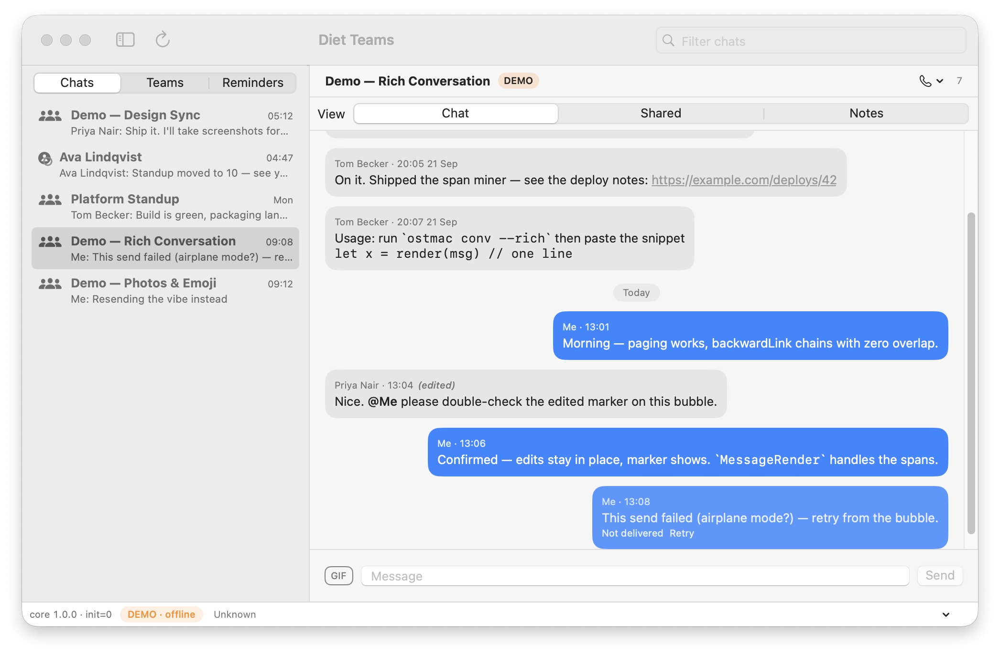
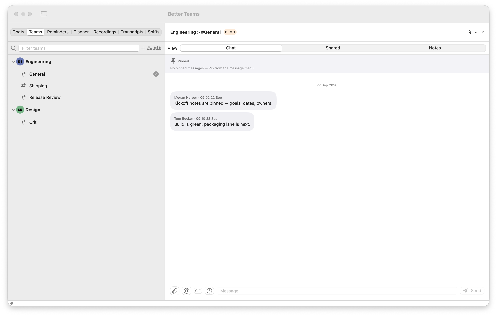
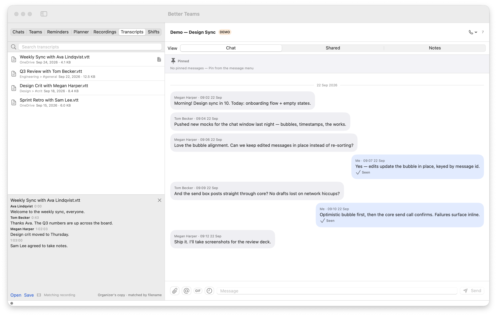
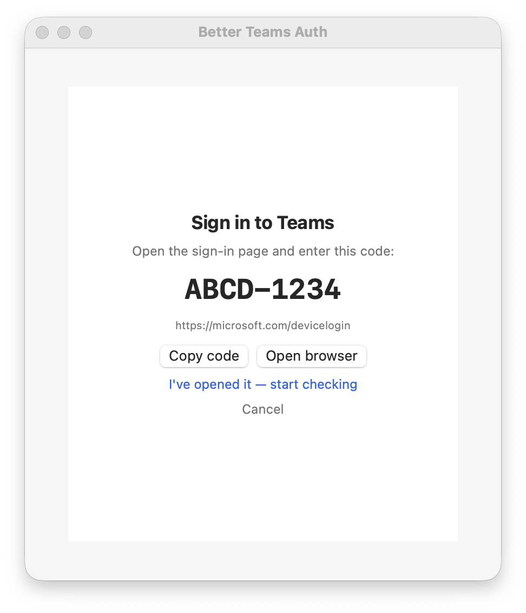
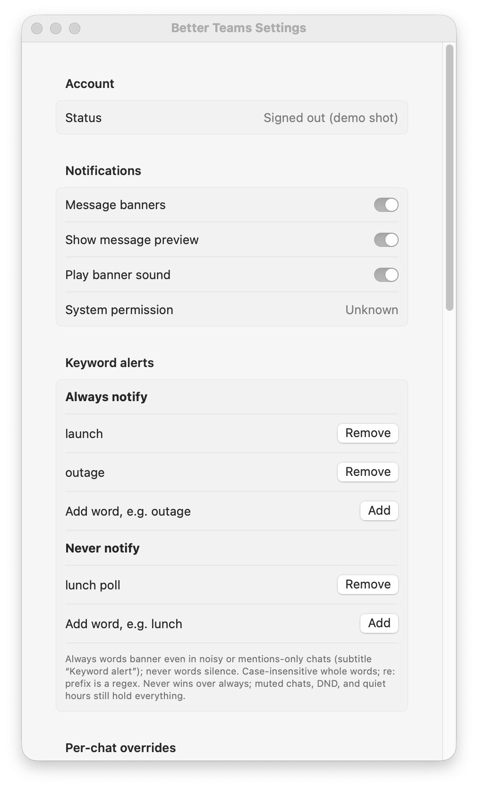

# Better Teams

Native macOS client for Microsoft Teams: chat list, conversation, live
updates, calls. A SwiftUI app over a Rust core (`ostmac-core` FFI staticlib)
built on vendored [`ost`](https://github.com/eisbaw/ost). Runs fully offline
in `--demo` with canned data; sign in via device code or browser to go live.







## Features

Chat & conversation
: Sidebar (Chats / Teams / Reminders, pinned Mentions/Notifications,
  user chat pins, mark-unread, hide, leave/block) + user chat folders
  with auto-rules + conversation with Chat / Shared / Notes tabs, live
  Trouter feed, paged history, ⌘K search palette (chats, messages,
  files, people), filters.
: Send, edit, delete, quote replies, emoji reactions, forward/copy/save,
  pinned messages, @-mention picker, scheduled send + pending queue,
  per-chat snooze, rich rendering (mentions, code, inline images, bot
  posts, adaptive cards, link previews), read receipts, typing
  indicators.
: Shared files (list/upload/download, folders + drill-in, share links,
  versions, move/copy/rename/delete, resumable big uploads, drag-drop +
  QuickLook, sort/filter, save-as) + composer attachments; GIF picker
  (bring-your-own Klipy key, kept in the macOS keychain).

Teams, meetings, reminders, notes
: Teams/channels browser (join/create team, create channel, channel
  detail + tabs, team roster); upcoming meetings + join-string parsing
  + lobby; meeting recordings browser + playback; meeting transcripts
  browser (OneDrive/channel .vtt, turns + matching recording);
  To Do lists/tasks; OneNote notebooks/sections/pages read + paragraph append.

Calls
: Signaling (place/accept/end, echo-bot test), live A/V banner,
  mic/speaker/camera panel with probes, screen sharing, recent call history.

Notifications & presence
: Native banners with rules, quiet hours, @me/@team mention alerts,
  keyword alerts (always/never words), per-chat levels (all /
  mentions-only / muted); own + per-user presence.

Auth & session
: Device-code + browser (PKCE capture) sign-in, 13-state auth gate,
  multi-account switcher with per-profile tokens, refresh/expiry
  handling, persisted on-disk session.

Extras
: AI thread catch-up (OpenCode CLI, on-device Apple Intelligence, or
  bring-your-own key, kept in the macOS keychain), offline message
  archive (compressed export + local search index),
  diagnostics/health windows, MCP server (`ostmac-mcp`,
  see `docs/mcp.md`).

## Requirements

- macOS 14+, Xcode command line tools (`swift`, `xcodebuild`), Rust (`cargo`)

## Build / install / run

```sh
./scripts/test.sh        # rust tests + swift tests (builds rust first)
./scripts/build-rust.sh  # vendored ost + ostmac-core staticlib (release)
./scripts/build-app.sh   # Better Teams.app in swift/.build/release
open "swift/.build/release/Better Teams.app"
open "swift/.build/release/Better Teams.app" --args --demo  # offline canned data
./scripts/package.sh [--install]  # signed release tmp/Better Teams.app (+ /Applications)
./scripts/make-dmg.sh    # versioned installer in tmp/
./scripts/install.sh     # copy the release app to /Applications
```

Signing: `CODESIGN_IDENTITY` wins; else the first Apple Development
identity; else ad-hoc (mic/camera grants won't stick across rebuilds).

## Usage

- Try offline first: `--demo` (also `--demo-rich`, `--demo-reactions`,
  `--demo-botposts`, `--demo-showcase`, `--chat <id>`).
- Sign in from the app: device code (copy code / open browser) or
  browser sign-in; the session persists across launches. Settings shows
  the account row plus token/probe diagnostics.
- `ostmac-mcp` exposes chats to MCP clients (Claude Desktop) — see
  `docs/mcp.md`. It reuses the app's session; sign in once in the app.

## Architecture

- `swift/` — SPM package: `OstMac` (the app), `OstMacCore` (state +
  views), `OstMacChatList` (sidebar), `DietDesign` (design system),
  `OstMacMCP` + `ostmac-mcp` executable, `DietShowcase` (design-system
  demo), `COstMac` (C header).
- `rust/ostmac-core/` — FFI `staticlib`: ~100-function C ABI, JSON over
  the boundary, every string freed with `ostmac_free`.
- `rust/ost/` — vendored upstream `ost` (built as a lib) plus our
  documented patch stack (`OSTMAC-PATCHES.md`, tagged `[minor]`/`[major]`).
- `scripts/` — `build-rust.sh`, `build-app.sh`, `package.sh`,
  `make-dmg.sh`, `install.sh`, `make-icon.sh`, `test.sh`.
- `docs/shots/` — demo-mode screenshots (all sanitized, no live data).

Rust builds first; Swift links the staticlib. JSON keeps the FFI
boundary version-tolerant.

## Testing

`./scripts/test.sh` runs ost unit tests, ostmac-core tests, a release
core build, then the Swift suites (`OstMacCoreTests`, `OstMacMCPTests`,
`DietDesignTests`).

## Upstream & credits

Teams protocol core: [eisbaw/ost](https://github.com/eisbaw/ost) (Open
Source Teams client, Rust) — thank you. It is vendored under `rust/ost`
so the app builds on macOS and exposes a library surface; every local
change is a documented patch in `rust/ost/OSTMAC-PATCHES.md`.

## Contributing

PRs welcome. Run `./scripts/test.sh` first, and keep screenshots
demo-mode only (`--demo` flags) — no live chats, names, or tokens in
commits.

## License

MIT — see [LICENSE](LICENSE).
