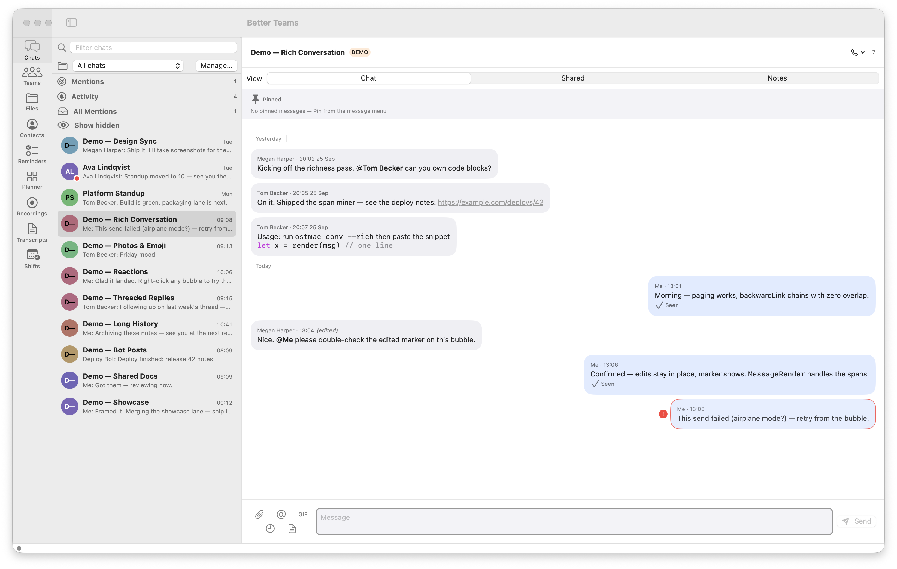
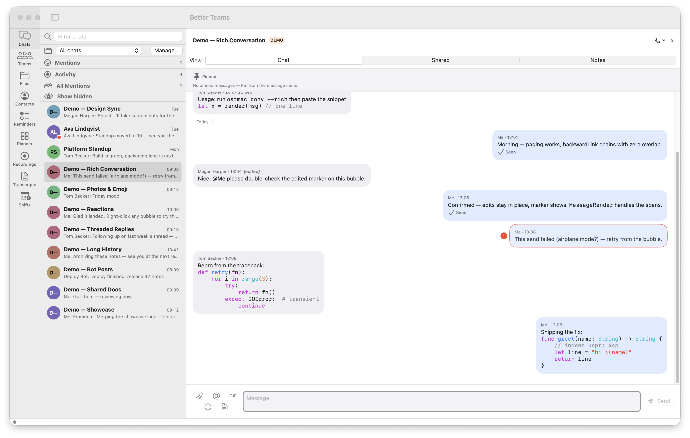
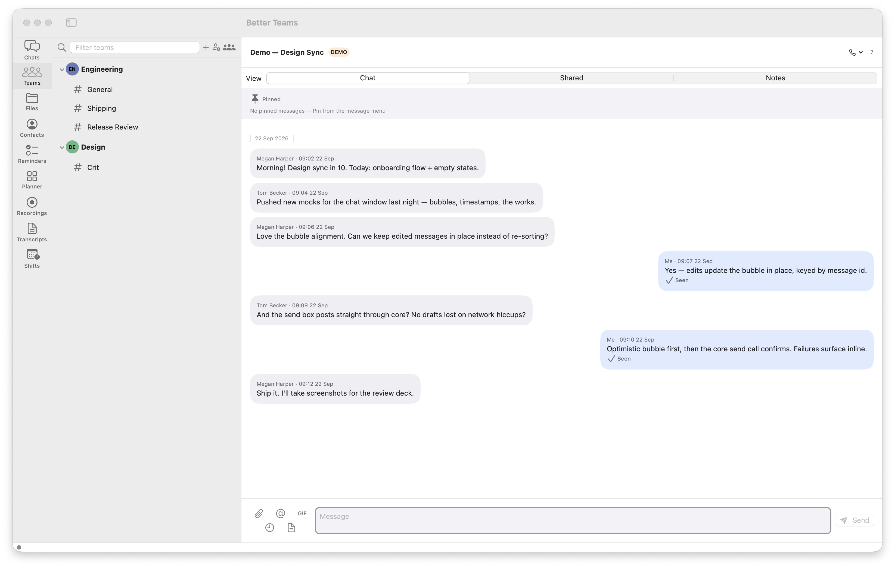
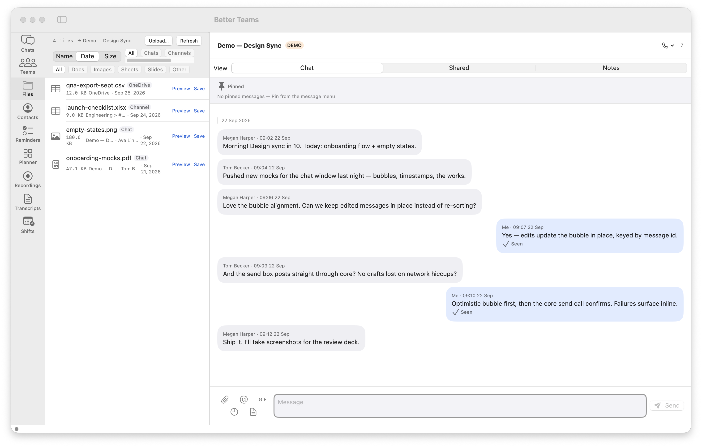

# Better Teams

Native macOS client for Microsoft Teams: chat list, conversation, live
updates, calls — plus third-party Teams apps hosted in-frame. A SwiftUI
app over a Rust core (`ostmac-core` FFI staticlib) built on vendored
[`ost`](https://github.com/eisbaw/ost). Runs fully offline in `--demo`
with canned data; sign in via device code or browser to go live.






## Features

Ten headline features:

1. Teams apps in-frame — third-party Teams apps hosted in a native
   frame: app registry + switcher, in-frame SSO (no re-auth), yanked
   escapes (native Open-in-Browser prompt), SSO popups, downloads,
   suspend-on-hide, draggable crop calibration.
2. Truthful presence — local activity truth (same idle counter as
   Screen Saver, 300s Teams-parity threshold), manual status lock
   (15m/1h/4h/until-off), precedence table rendered verbatim in
   Diagnostics, session change log, 12s undo toasts. No silent flips.
3. Unified files — one Files rail surface across chats, channels,
   and OneDrive/SharePoint drive recents (catches conversation-less
   uploads); source badges, sort/filter, save-first QuickLook +
   share sheet, panel + drop upload.
4. Code-first messaging — fenced blocks render highlighted (36
   languages, offline, native bubbles), plain-text-first paste
   rescues VS Code indents, sends preserve bytes exactly, fenced
   blocks go out as `<pre>` on the wire.
5. Menu-bar + lean startup — opt-in login item (never re-enables
   itself), menu-bar extra (presence dot + unread count, top-8
   unread popover), deferred meeting-engine and camera allocation
   (zero media inits before join), cold-start probe.
6. Offline search — local message index wired into ⌘K: offline-first
   merge (online above, offline-only extras below, source badge),
   airplane-mode fallback, per-account persist, sticky scope +
   last query, 5 persisted recent searches.
7. Side-by-side accounts — "Open in New Window" per account; both
   windows live-update independently (live feed + background sweep
   fan-out); close merges unread back, re-open restores with no
   refetch.
8. Pop-out everything — chats (row menu + double-click), channels,
   meetings, and file previews each pop to their own window with
   live updates; re-pop focuses, close loses no state or drafts.
9. Screenshare that works — ScreenCaptureKit engine + native macOS
   system picker (the path Microsoft's own workaround recommends),
   prompt-free preflight, one-click Privacy Settings fix, every
   state renders a preview or status placeholder — never blank.
10. Never miss calls — incoming calls post a system notification
    with Accept/Decline plus an audible ring until answered or
    timeout; ring respects the system mute switch, Focus/DND
    suppress by OS policy. (CallKit provider API is
    `API_UNAVAILABLE` on macOS — the banner IS the native answer
    surface.)

Everything else, by area:

Chat & conversation
: Sidebar: Chats / Teams / Reminders, pins, chat folders with
  auto-rules, filters, ⌘K palette (chats, messages, files, people);
  pinned Mentions/Notifications, mark-unread, hide, leave/block;
  conversation with Chat / Shared / Notes tabs, live Trouter feed,
  paged history.
: Composer: send, edit, delete, quote replies, emoji reactions,
  scheduled send + pending queue, per-chat snooze, forward/copy/save,
  pinned messages, @-mention picker; GIF picker (bring-your-own
  Klipy key, kept in the macOS keychain).
: Rich conversation: mentions, inline images, bot posts, adaptive
  cards, link previews, read receipts, typing indicators.
: Shared files: list/upload/download, folders + drill-in, share
  links, versions, move/copy/rename/delete, resumable big uploads,
  drag-drop + QuickLook, sort/filter, save-as; composer attachments.
: Jump-to-context: search hits land on the exact bubble; misses say
  "Message no longer available" (never a silent top-open), and
  Diagnostics logs the attempt/land/miss rate.

Teams, meetings, calls
: Teams & channels browser — join/create team, create channel,
  channel detail + tabs, team roster.
: Meetings — upcoming list, join parsing + lobby, recordings browser
  + playback, transcripts browser (turns + matching recording).
: Calls — place/accept/end, live A/V banner, mic/speaker/camera
  panel, echo-bot test, call history.

Notifications & accounts
: Native banners with rules, quiet hours (Focus sync on by
  default), @me/@team and keyword alerts, per-chat levels.
: Multi-account: device code or browser (PKCE) sign-in, one-click
  switcher, persisted per-profile session, background sweep posts
  `[account]`-named banners for inactive accounts with unread
  roll-up on switch.

Productivity
: AI thread catch-up — OpenCode CLI, on-device Apple Intelligence,
  or bring-your-own key (macOS keychain).
: To Do lists/tasks; OneNote notebooks/sections/pages read +
  paragraph append.
: Offline message archive (compressed export + local search index).

Session, diagnostics, integration
: 13-state auth gate, per-profile tokens, refresh/expiry handling.
: Diagnostics/health windows (presence truth, message jump, offline
  search, cold-start); MCP server (`ostmac-mcp`, see `docs/mcp.md`)
  reusing the app's session.

## Requirements

- macOS 14+, Xcode command line tools (`swift`, `xcodebuild`), Rust (`cargo`)

## Build / install / run

```sh
./scripts/test.sh        # rust tests + swift tests (builds rust first)
./scripts/build-rust.sh  # vendored ost + ostmac-core staticlib (release)
./scripts/build-app.sh   # Better Teams.app in swift/.build/release
open "swift/.build/release/Better Teams.app"
open "swift/.build/release/Better Teams.app" --args --demo  # offline canned data
./scripts/package.sh [--install]  # signed release tmp/Better Teams.app (+ /Applications)
./scripts/make-dmg.sh    # versioned installer in tmp/
./scripts/install.sh     # copy the release app to /Applications
```

Signing: `CODESIGN_IDENTITY` wins; else the first Apple Development
identity; else ad-hoc (mic/camera grants won't stick across rebuilds).

## Usage

- Try offline first: `--demo` (also `--demo-rich`, `--demo-reactions`,
  `--demo-botposts`, `--demo-showcase`, `--chat <id>`).
- Sign in from the app: device code (copy code / open browser) or
  browser sign-in; the session persists across launches. Settings shows
  the account row plus token/probe diagnostics.
- `ostmac-mcp` exposes chats to MCP clients (Claude Desktop) — see
  `docs/mcp.md`. It reuses the app's session; sign in once in the app.

## Architecture

- `swift/` — SPM package: `OstMac` (the app), `OstMacCore` (state +
  views), `OstMacChatList` (sidebar), `DietDesign` (design system),
  `OstMacMCP` + `ostmac-mcp` executable, `DietShowcase` (design-system
  demo), `COstMac` (C header).
- `rust/ostmac-core/` — FFI `staticlib`: ~100-function C ABI, JSON over
  the boundary, every string freed with `ostmac_free`.
- `rust/ost/` — vendored upstream `ost` (built as a lib) plus our
  documented patch stack (`OSTMAC-PATCHES.md`, tagged `[minor]`/`[major]`).
- `scripts/` — `build-rust.sh`, `build-app.sh`, `package.sh`,
  `make-dmg.sh`, `install.sh`, `make-icon.sh`, `test.sh`.
- `docs/shots/` — demo-mode screenshots (all sanitized, no live data).

Rust builds first; Swift links the staticlib. JSON keeps the FFI
boundary version-tolerant.

## Testing

`./scripts/test.sh` runs ost unit tests, ostmac-core tests, a release
core build, then the Swift suites (`OstMacCoreTests`, `OstMacMCPTests`,
`DietDesignTests`).

## Upstream & credits

Teams protocol core: [eisbaw/ost](https://github.com/eisbaw/ost) (Open
Source Teams client, Rust) — thank you. It is vendored under `rust/ost`
so the app builds on macOS and exposes a library surface; every local
change is a documented patch in `rust/ost/OSTMAC-PATCHES.md`.

## Contributing

PRs welcome. Run `./scripts/test.sh` first, and keep screenshots
demo-mode only (`--demo` flags) — no live chats, names, or tokens in
commits.

## License

MIT — see [LICENSE](LICENSE).
